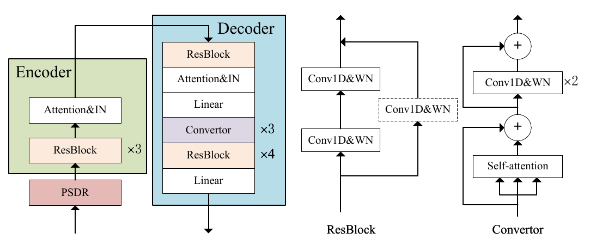

# SingleVC

Here is the official implementation of the paper, [MediumVC](https).

The following are the overall model architecture.


For the audio samples, please refer to our [demo page](https://brightgu.github.io/SingleVC/). The more details can be found in "any2one/demo_page/ConvertedSpeeches/".

### Envs
You can install the dependencies with
```bash
pip install -r requirements.txt
```

### PSDR
[PSDR](http://www.guitarpitchshifter.com/algorithm.html) means scaling F0 and correlative harmonics with duration remained, which intuitively modifying the speaker-related information while maintaining linguistic content and prosodic information. PSDR can be used as a data augment strategy for VC by producing fake parallel corpus. To verify its feasibility that slight pitch shifts don't affect content information,  we measure the word error rate(WER) between source speeches and pitch-shifted speeches through [Wav2Vec2-based ASR System](https://github.com/huggingface/transformers). The speeches of p249(female) from VCTK Corupsis selected, and [pyrubberband](https://github.com/bmcfee/pyrubberband) is utilized to  execute PSDR. Table indicates that when S in -6~4, the strategy applies to VC with acceptable WERs.

| S | -7 | -6 | -5 |0 | 3| 4 | 5 |
| :------:| :------: | :------: |:------: |:------: |:------: |:------: |:------: |
| WER(%) | 40.51 | 25.79 |17.25 |0 |17.27 |25.21 |48.14 |


### Vocoder
The [HiFi-GAN](https://github.com/jik876/hifi-gan) vocoder is employed to convert log mel-spectrograms to waveforms. The model is trained on universal datasets with 13.93M parameters. Through our evaluation, it can synthesize 22.05 kHz high-fidelity speeches over 4.0 MOS, even in cross-language or noisy environments.

## pretrained models
You can download the pretrained model as well as the vocoder following the [link](https://drive.google.com/file/d/1yV9cCne7piqBI9vng13JDdLuRlMkTbZR/view?usp=sharing), and then edit the config file any2one/infer/infer_config.yaml.  Infer corpus should be organized as test22050/*.wav
You can convert an list of  utterances, e.g.
```bash
python any2one/infer/infer.py
```
## Train from scratch
The train corpus should be organized as vctk22050/p249/*.wav
```bash
python any2one/solver.py
```
### Preprocessing
The model is trained with random pitch shifted speeches processed in real-time. If you want to speed up the training, please refer the code in "any2one/meldataset.py" to have data preprocessed.
